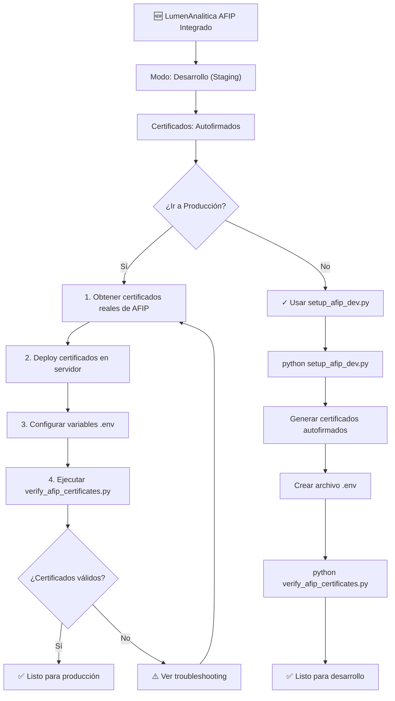

# 🎯 Flujo de Configuración AFIP

## Estado Actual



## Estructura de Configuración

```
┌─────────────────────────────────────────────────┐
│         LumenAnalitica con AFIP                  │
├─────────────────────────────────────────────────┤
│                                                   │
│  app.py (Integración AFIP)                      │
│  ├── AFIPClient → Conexión a AFIP               │
│  ├── score_afip() → Puntaje fiscal              │
│  └── parse_afip_resumen() → Parsear datos       │
│                                                   │
├─────────────────────────────────────────────────┤
│  config.py (Configuración Centralizada)         │
│  ├── AFIPConfig::CUIT                           │
│  ├── AFIPConfig::CERT_PATH                      │
│  ├── AFIPConfig::KEY_PATH                       │
│  └── AFIPConfig::PRODUCTION                     │
│                                                   │
├─────────────────────────────────────────────────┤
│  .env (Variables de Entorno) - ❌ NO en Git     │
│  ├── AFIP_CUIT=20123456789                      │
│  ├── AFIP_CERT_PATH=...                         │
│  ├── AFIP_KEY_PATH=...                          │
│  └── AFIP_PRODUCTION=true/false                 │
│                                                   │
├─────────────────────────────────────────────────┤
│  Certificados                                    │
│  ├── certificate.crt (Certificado X.509)        │
│  ├── private_key.pem (Clave privada RSA)        │
│  └── [Permisos: 644/600]                        │
│                                                   │
├─────────────────────────────────────────────────┤
│  Scripts de Utilidad                             │
│  ├── setup_afip_dev.py → Generar certificados   │
│  └── verify_afip_certificates.py → Validar      │
│                                                   │
└─────────────────────────────────────────────────┘
```

## Línea de Tiempo de Implementación

### Fase 1: Desarrollo ✅ (YA COMPLETADA)
```
Día 1:
  ✓ Instalar afip.py package
  ✓ Crear AFIPClient class
  ✓ Crear AFIPResumen dataclass
  ✓ Implementar score_afip()
  ✓ Integrar scoring en motor decisión
  ✓ Actualizar UI con datos AFIP
```

### Fase 2: Staging (AHORA)
```
Próxima:
  □ python setup_afip_dev.py
  □ python verify_afip_certificates.py
  □ Pruebas funcionales
  □ Validar scoring fiscal
```

### Fase 3: Producción
```
Cuando esté listo:
  □ Obtener certificados reales AFIP
  □ Desplegar en servidor
  □ Configurar .env en producción
  □ Ejecutar verify_afip_certificates.py
  □ Monitorear logs
```

## Decisión en Evaluación Crediticia

### Ponderación de Factores

```
SCORE TOTAL = 
    (Score Crédito × 40%) +
    (Score Cheques × 15%) +
    (Score Patrimonial × 25%) +
    (Score AFIP × 20%)  ← 🆕 NUEVO
────────────────────────────────
    = Puntuación Final (0-100)

DECISIÓN:
  ✅ APROBAR  si Score ≥ 80
  ⚠️  REVISAR si Score 55-79
  ❌ RECHAZAR si Score < 55

REGLAS DURAS:
  • Si AFIP no está "Al día" → REVISAR
  • Si BCRA situación ≥ 4 → RECHAZAR
  • Si cheques ≥ 6 → RECHAZAR
```

## Seguridad Implementada

```
┌─────────────────────────────────────────────┐
│        Capas de Seguridad AFIP              │
├─────────────────────────────────────────────┤
│                                               │
│  1. Credenciales en Código
│     ❌ NO: CUIT hardcodeado
│     ✅ SÍ: Variables de entorno
│                                               │
│  2. Certificados
│     ❌ NO: Commiteados a Git
│     ✅ SÍ: En .gitignore
│     ✅ SÍ: Permisos 600/644
│                                               │
│  3. Almacenamiento
│     ❌ NO: En /tmp
│     ✅ SÍ: En /etc/lumenanalitica/
│     ✅ SÍ: Con permisos restrictivos
│                                               │
│  4. Transporte
│     ❌ NO: Por HTTP
│     ✅ SÍ: HTTPS/TLS
│     ✅ SÍ: Certificado validado
│                                               │
│  5. Auditoría
│     ✅ SÍ: Logs de consultas
│     ✅ SÍ: CUIT ofuscado en logs
│                                               │
└─────────────────────────────────────────────┘
```

## Ciclo de Vida del Certificado

```
┌──────────────────────────────────────────────┐
│    Renovación Anual de Certificados           │
├──────────────────────────────────────────────┤
│                                                │
│  Día 1:        Certificado emitido            │
│  ├─ Válido por: 365 días                      │
│  └─ Monitoreo: Automático                     │
│                                                │
│  Día 300:      ALERTA - 65 días para expirar  │
│  ├─ Notificación: Email/Dashboard             │
│  └─ Acción: Preparar renovación               │
│                                                │
│  Día 335:      CRÍTICO - 30 días para expirar │
│  ├─ Notificación: Escalado                    │
│  └─ Acción: Renovación URGENTE                │
│                                                │
│  Día 350:      Nuevo certificado listo        │
│  ├─ Testing: En staging                       │
│  └─ Deployment: Cambio a nuevo cert           │
│                                                │
│  Día 365:      Certificado vence              │
│  ├─ Status: Certificado nuevo en uso          │
│  └─ Viejo: Backup (3 años)                    │
│                                                │
└──────────────────────────────────────────────┘
```

## Comparativa: Desarrollo vs Producción

| Aspecto | Desarrollo | Producción |
|---------|-----------|-----------|
| **Certificados** | Autofirmados | Reales AFIP |
| **Generación** | `setup_afip_dev.py` | Portal AFIP |
| **Ubicación** | `./afip_certs/` | `/etc/lumenanalitica/` |
| **Validez** | 365 días (test) | 365 días (real) |
| **Mode AFIP** | `PRODUCTION=false` | `PRODUCTION=true` |
| **Endpoint** | Staging AFIP | Producción AFIP |
| **Datos** | Simulados | Reales |
| **Performance** | Tolerante | Optimizado |
| **Logs** | Verbosos | Selectivos |

## Comandos Rápidos

```bash
# DESARROLLO
# ──────────
# 1. Setup inicial
python setup_afip_dev.py --cuit 20123456789

# 2. Verificar configuración
python verify_afip_certificates.py

# 3. Ver estado
python -c "from config import AFIPConfig; print(AFIPConfig.get_status())"

# 4. Iniciar app
streamlit run app.py


# PRODUCCIÓN
# ──────────
# 1. Verificar certificados en servidor
ssh usuario@servidor
python verify_afip_certificates.py

# 2. Ver logs
tail -f /var/log/lumenanalitica/app.log

# 3. Ver logs AFIP específicamente
tail -f /var/log/lumenanalitica/afip.log

# 4. Monitorear vencimiento
crontab -l | grep "check_cert_expiry.py"

# 5. Hacer backup de configuración
sudo tar -czf /backup/lumenanalitica-config.tar.gz \
  /etc/lumenanalitica/afip_certs/ \
  /var/lib/lumenanalitica/
```

## Estado del Proyecto

```
╔════════════════════════════════════════════════════╗
║                  PROYECTO ACTUAL                   ║
╠════════════════════════════════════════════════════╣
║                                                    ║
║  ✅ COMPLETADO:                                   ║
║    • Integración AFIP en app.py                  ║
║    • Scoring fiscal implementado (20% peso)     ║
║    • UI actualizada con datos AFIP              ║
║    • Configuración centralizada (config.py)     ║
║    • Scripts de setup y verificación             ║
║    • Documentación completa                      ║
║                                                    ║
║  🔄 EN PROGRESO:                                 ║
║    • Pruebas en staging                          ║
║    • Documentación en producción                 ║
║                                                    ║
║  ⏳ PRÓXIMO:                                      ║
║    • Deploy en servidor de producción            ║
║    • Configurar monitoreo de certificados        ║
║    • Implementar alertas de vencimiento          ║
║    • Auditoría de logs AFIP                      ║
║                                                    ║
╚════════════════════════════════════════════════════╝
```

---

**Creado:** 2026-03-31  
**Versión:** 1.0  
**Estado:** Listo para staging/producción
